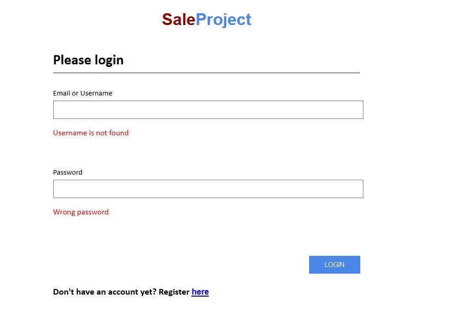
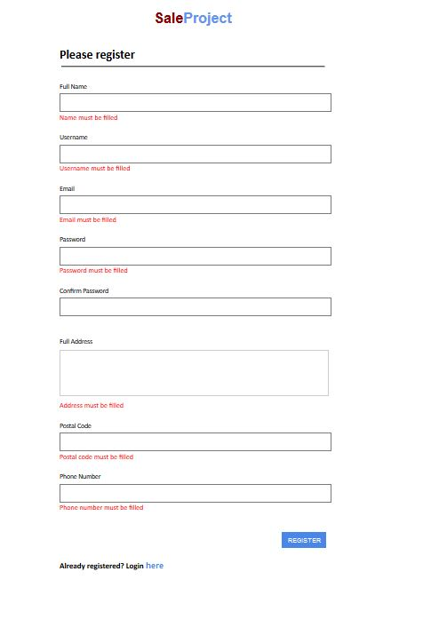
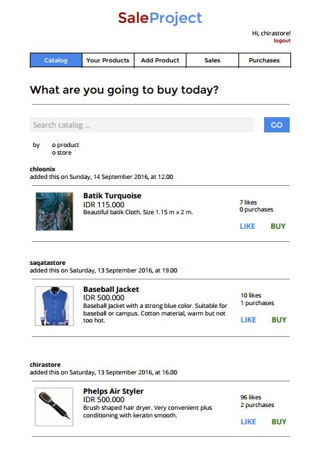
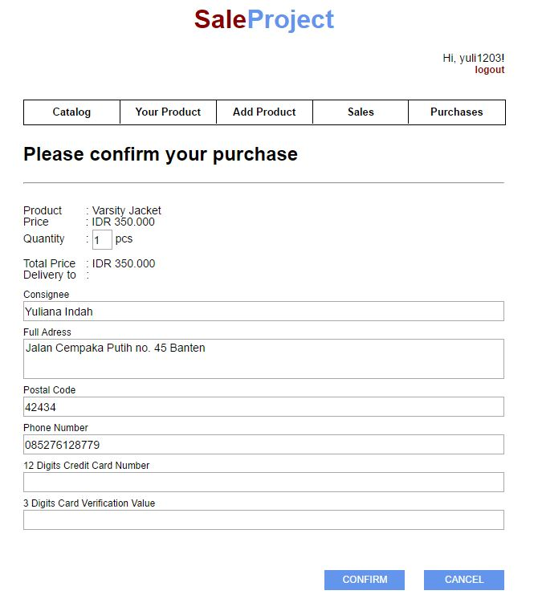
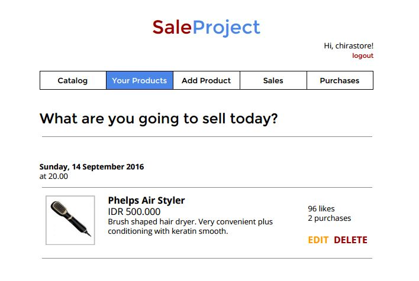
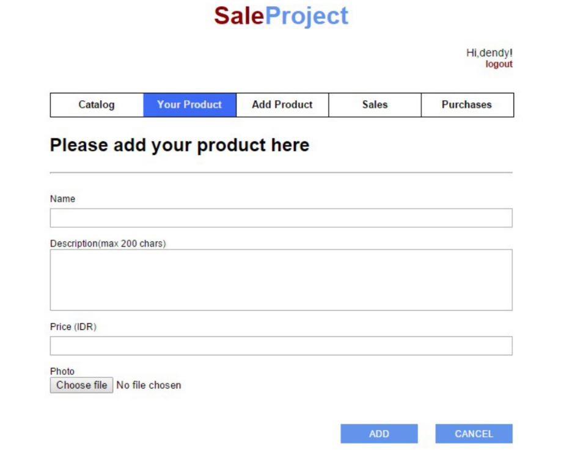
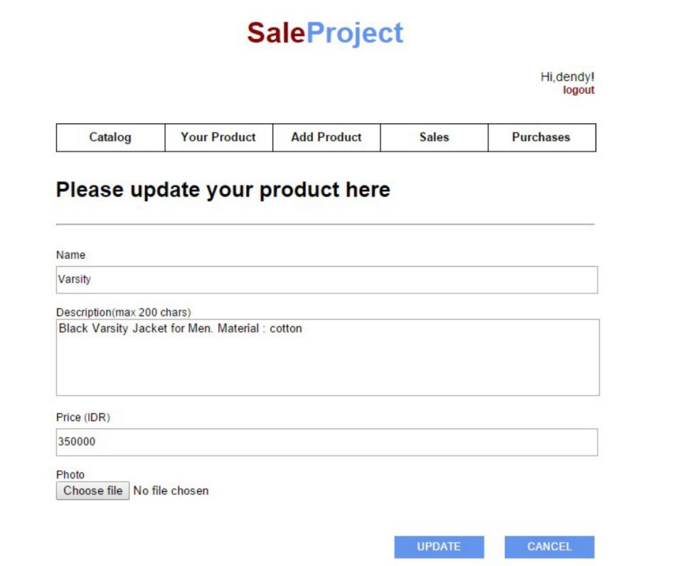
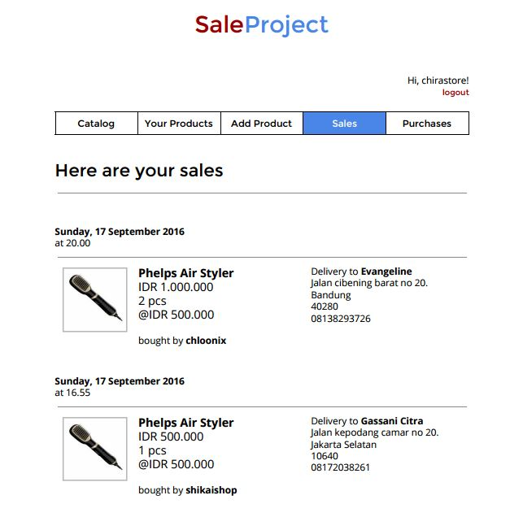
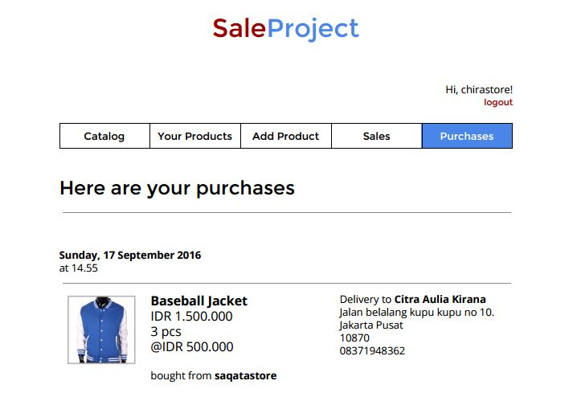

# Tugas 1 IF3110 Pengembangan Aplikasi Berbasis Web

Membuat Website Marketplace sederhana.

## Deskripsi Singkat

Pada tugas besar ini, kami diminta untuk membuat sebuah aplikasi *marketplace* **berbasis web** sederhana bernama **"SaleProject"** yang memungkinkan seorang pengguna membeli dan menjual barang melalui website. Untuk menggunakan aplikasi ini, pengguna harus melakukan login terlebih dahulu. Jika belum memiliki akun, maka pengguna harus melakukan registrasi terlebih dahulu. Setelah berhasil melakukan login, pengguna tersebut dapat menggunakan berbagai fitur-fitur pada **SaleProject** seperti membeli dan menjual barang dengan akun yang sama. Pengguna juga dapat melihat catalog seluruh barang, melihat histori penjualan, histori pembelian, dan list produk-produk yang dijualnya.

## Anggota Tim

Catherine Pricilla/13514004
Dendy Suprihady/13514070
Scarletta Julia Yapfrine/13514074

## Fitur-Fitur pada SaleProject

### Login

Halaman **Login** merupakan halaman pertama yang akan dibuka oleh pengguna saat membuka aplikasi. Untuk menggunakan fitur-fitur dari aplikasi, pengguna harus melalukan login terlebih dahulu sebagai *user* yang sudah terdaftar. Saat melakukan login, pengguna harus mengisi data *username* dan *password*-nya pada form, jika *username* dan *password* yang dimasukkan benar maka user akan teralih ke halaman **Catalog**.

Untuk pengguna baru yang belum memiliki akun yang terdaftar pada **SaleProject**, terdapat *link* pada bagian bawah halaman yang akan membawa pengguna ke halaman **Register** untuk membuat akun.

### Register

Halaman **Register** dapat diakses melalui *link* pada halaman **Login**. Pengguna dapat mendaftarkan diri sebagai *user* agar dapat menggunakan aplikasi ini. Pengguna akan diminta untuk mengisi semua data pribadi seperti nama, alamat, nomor telepon, email, username dan password pada form. Untuk melakukan registrasi, harus menggunakan username dan email yang belum pernah terdaftar sebagai *user* pada **SaleProject**. Setelah selesai melakukan registrasi, maka *user* akan secara otomatis masuk ke halaman **Catalog** dengan keadaan sudah login.

### Catalog

Halaman **Catalog** merupakan halaman utama yang ditampilkan ketika *user* telah berhasil melakukan login. Di halaman ini akan menampilkan list barang yang dijual oleh seluruh *user* dari **SaleProject**. Barang-barang tersebut ditampilkan terurut dimulai dari barang yang baru ditambahkan ke barang yang paling lama.

Pada halaman ini pengguna dapat "menyukai" produk dengan cara mengklik tombol *like* pada produk. *User* juga dapat memilih produk yang diingininya melalui tombol *buy* dan akan teralihkan ke halaman **Confirmation Purchase**.

### Confirmation Purchase

Setelah *user* memilih untuk membeli barang dari halaman **Catalog**, *user* akan secara otomatis masuk ke halaman **Confirmation Purchase**. Pada halaman ini, *user* harus mengisi form dengan identitas terkait pengiriman barang. Pada *field* selain *credit card number*, form sudah terisi sesuai dengan data *user* namun tetap dapat diubah. Untuk *field quantity* memiliki nilai default 1. Setelah mengkonfirmasi pembelian, maka *user* akan teralih ke halaman **Purchases**.

### Your Products

Halaman **Your Product** dapat diakses melalui *navigation bar*. Halaman ini menampilkan list barang yang dijual oleh *user*. Penampilan akan terurut dari barang terbaru hingga barang terlama. *User* juga dapat menghapus barang yang dijualnya melalui halaman ini. Untuk mencegah hal yang tidak diinginkan seperti dengan tidak sengaja mengklik tombol hapus, maka sebelum menghapus akan muncul *alert box* agar penggunga dapat mengkonfirmasi penghapusan.

### Add Product

*User* dapat menambahkan barang untuk dijual melalui halaman **Add Product**. Halaman ini dapat diakses melalui *navigation bar*. Halaman akan berisi form yang harus diisi secara lengkap oleh *user*. Jika terdapat informasi yang kurang, maka *user* tidak dapat menambahkan produk. Jika pengisian form sudah *valid* maka halaman akan otomatis teralih ke **Your Product** dengan penambahan produk. 

### Edit Product

*User* dapat mengubah info barang yang sudah dibuat olehnya melalu halaman **Your Product**. Halaman akan berisi form yang sudah terinisialisasi dengan info-info dari barang tersebut. *User* dapat mengubah semua infonya kecuali gambar dari produknya. Jika semua penggantian informasi valid, *user* akan secara otomatis masuk kembali ke halaman **Your Product** dengan informasi produk yang sudah diperbaharui. 

### Sales

Halaman **Sale** dapat diakses melalui *navigation bar*. Halaman ini menampilkan histori list penjualan barang yang dijual oleh *user*. Histori ini akan tetap sama atau tidak berubah sekalipun data barang yang bersangkutan tersebut telah diubah/dihapus. *User* tetap dapat melihat data pembelian seperti saat mereka menjual produk tersebut.

### Purchases

Halaman **Purchases** dapat diakses melalui *navigation bar*. Halaman ini menampilkan histori list pembelian barang oleh *user*. Histori ini akan tetap sama atau tidak berubah sekalipun data barang yang bersangkutan tersebut telah diubah/dihapus. *User* tetap dapat melihat data pembelian seperti saat mereka membeli produk tersebut.

## Pembagian Tugas

**Tampilan**
1. Login : 13514074
2. Register : 13514074
3. Catalog : 13514070
4. Confirmation Purchase : 13514004
5. Your Products : 13514070
6. Add Product : 13514070
7. Edit Product : 13514070
8. Sales : 13514070
9. Purchase : 13514070

**Fungsionalitas**
1. Login : 13514074
2. Register : 13514074
3. Catalog : 13514074
4. Confirmation Purchase : 13514004
5. Your Products : 13514004
6. Add Product : 13514070
7. Edit Product : 13514070
8. Sales : 13515004
9. Purchase : 13514004

## About

Team : Catherine Pricilla | Dendy Suprihady | Scarletta Julia Yapfrine

Asisten IF3110 2016

Adin | Chairuni | David | Natan | Nilta | Tifani | Wawan | William

Dosen : Yudistira Dwi Wardhana | Riza Satria Perdana
